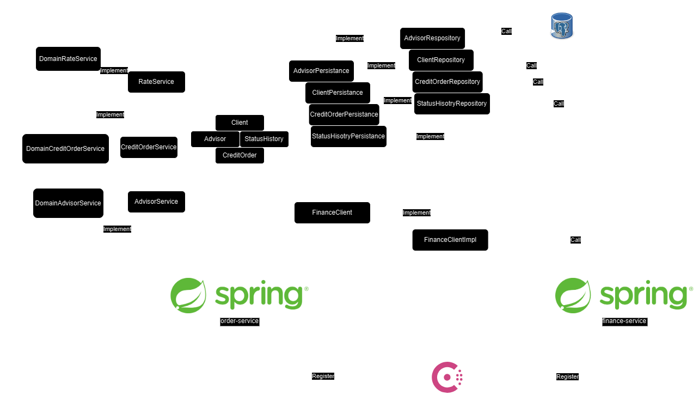

# Projet Spring Boot avec API RESTful et HATEOAS

Ce projet contient deux services Spring Boot qui fournissent des API RESTful avec HATEOAS. Les services sont écrits en Java 21 et utilisent Spring Boot 3.

## Démarrage

### Configuration requise

- Java 21
- Maven
- Docker

### Installation et démarrage

1. Clonez ce dépôt sur votre machine locale.

2. Assurez-vous que Docker est installé et fonctionnel sur votre système.

3. Utilisez Docker Compose pour démarrer les conteneurs nécessaires à l'exécution des API :

```bash
docker compose up 
```

Compilez chaque service à l'aide de Maven :

```bash
cd order-service
mvn clean package -DskipTests
cd ../finance-service 
mvn clean package -DskipTests
cd ..
```
Démarrez les services localement à l'aide de Java :

```bash
java -jar order-service/target/order-service-0.0.1-SNAPSHOT.jar
java -jar finance-service/target/finance-service-0.0.1-SNAPSHOT.jar
```

Le service des finances n'a pas pour but d'être appelé directement par l'extérieur, ainsi son port de démarrage est inconnu. Le service de demande de crédit quant à lui démarre sur le port 8585.

### Accéder à Swagger
Une interface Swagger est disponible pour explorer les API. Vous pouvez y accéder à l'adresse suivante : ``` http://localhost:8585/swagger-ui.html ```

# Description de l'implémentation 

## Réponse au besoin

L'API RESTful a été réalisée grâce à HATEOAS. La gestion des demandes de crédit a été la plus soignée. Les autres contrôleurs (utilisateurs et conseillers) sont là pour vous aider à tester l'API correctement mais n'ont pas reçu la même attention lors de la conception et de l'implémentation.

Initialement, l'API aurait dû se servir d'un serveur d'authentification tel que Keycloak pour récupérer les utilisateurs connectés ou les conseillers qui valident les demandes. Cependant, le manque de temps ne m'a pas permis de réaliser cette fonctionnalité.

### Historique des validations

L'historique des validations est géré à travers une entité "StatusHistory". Elle permet de sauvegarder les changements de statut avec leur initiateur et la date de validation.

L'objectif était de ne pas avoir à récupérer l'intégralité de l'historique d'une demande au sein d'un seul objet. L'utilisation de mapping @OneToMany() et @ManyToOne() aurait rendu obligatoire la récupération des objets encapsulés, ce qui devait être évité ici pour le cas particulier de l'historique.

### Gestion des erreurs

La gestion des erreurs a été entièrement réalisée grâce à des exceptions personnalisées et à un intercepteur d'exception (ExceptionResponseHandler). Celui-ci permet de formater correctement la réponse envoyée à l'initiateur de la requête même en cas d'erreurs.

La plupart des cas ont été traités, cependant, il est possible que des erreurs plus subtiles n'aient pas pu être prises en compte, comme certaines erreurs en base de données par exemple.

L'écriture de tests d'intégration avec Testcontainers, par exemple, aurait permis de vérifier la totalité des cas et d'assurer la non-régression dans le futur. Malheureusement, le manque de temps a été un obstacle à cette étape.

### Model assemblers

Pour répondre aux normes et méthodes RESTful, nous avons utilisé HATEOAS. Les objets du domaine disposent tous d'un assembleur correspondant. Ces assembleurs facilitent la formation des réponses des APIs RESTful en utilisant Spring.

Les demandes de crédit possèdent également un objet DTO : "clientOrder".

Lorsqu'un client interagit avec l'API, il ne peut le faire qu'en partageant une demande client et ne reçoit que les informations contenues dans la demande client. Il ne peut pas consulter des informations plus sensibles que celles auxquelles il devrait avoir accès.

### Premier chargement des données 

Pour ce qui est du premier chargement des données, seuls les conseillers et les managers sont créés automatiquement. Pour tester l'application, vous devrez créer un utilisateur et une demande de crédit.

Aucune authentification n'est nécessaire, il sera donc facile de suivre tout le cycle de vie d'une demande de crédit à travers de l'API.

Comme l'API est RESTful, vous devriez toujours avoir le lien vers la prochaine action réalisable disponible dans les réponses de vos requêtes. Cela simplifie grandement le suivi du cycle de vie.

Une page Swagger est également mise à votre disposition pour vous aider à réaliser les requêtes et à saisir leur contenu.

## Architecture

L'architecture se compose de trois composantes principales :

* Le domaine : C'est la couche qui définit l'ensemble des classes métiers. Elle contient les entités, les objets de valeur, les agrégats, ainsi que les règles métier et la logique de domaine.

* Les ports : Cette couche définit les interfaces métiers nécessaires au découplage et à la communication entre les différents adaptateurs et le domaine. On y trouve :

    * Les interfaces de persistance, qui spécifient les opérations CRUD nécessaires pour accéder aux données.
    * Les interfaces des services métiers, qui définissent les opérations métier à exécuter.
    * Les interfaces clients, comme par exemple une interface pour un client de services externes (dans votre cas, un seul : FinanceClient).
* Les adaptateurs : Cette couche contient les différentes implémentations des interfaces des ports. Chaque adaptateur fournit une implémentation concrète des opérations définies dans les ports, en utilisant les détails techniques spécifiques à son environnement. Par exemple, un adaptateur de persistance peut fournir une implémentation JDBC pour une interface de persistance, tandis qu'un adaptateur de service peut fournir une implémentation REST pour une interface de service métier.

Cette architecture permet un découplage fort entre le domaine et les détails techniques de mise en œuvre, ce qui facilite la maintenance, les tests et l'évolutivité du système.

Voici un diagramme reprenant l'architecture du projet :


## Réalisation

### Circuit breaker

Un circuit breaker a été mis en place ici. Il a été testé et il est fonctionnel. Cependant, il est possible qu'il soit mal implémenté. La façon dont le circuit breaker a été réalisé peut ne pas être la meilleure, car elle empêche l'utilisateur de recevoir une réponse correcte si le service financier est hors service. Il serait peut-être préférable de récupérer une partie des informations sans pour autant afficher un message d'erreur. D'un autre côté, l'utilisateur de l'API ne serait jamais informé que le service financier ne peut pas répondre, ce qui pourrait entraîner une confusion quant à pourquoi le service financier ne valide jamais les demandes.

### Découplage des composants

Le découplage des composants prévu par cette architecture a été parfaitement respecté. Aucune des implémentations n'est jamais utilisée directement ; les interfaces servent toujours de points de liaison entre les différents composants ou adaptateurs.

### Création d'un client pour les appels vers le service finance

Pour la communication avec le service financier, le RestClient a été utilisé. Une interface client a été créée, avec son implémentation en tant qu'adaptateurs.

### Amélioration 

#### Tests unitaires & tests d'intégration

Une amélioration évidente serait d'écrire des tests unitaires et des tests d'intégration en utilisant Spring, avec l'ajout de TestContainers pour tester le fonctionnement de la base de données dans son intégralité. Cela permettrait de s'assurer de l'absence de régressions au cours des futurs développements.

#### Intégration de keycloak pour l'authentification

L'intégration de Keycloak pour l'authentification pourrait permettre de ne plus avoir à gérer les objets conseiller et client dans le domaine. Keycloak pourrait être utilisé entièrement pour la gestion des utilisateurs.

